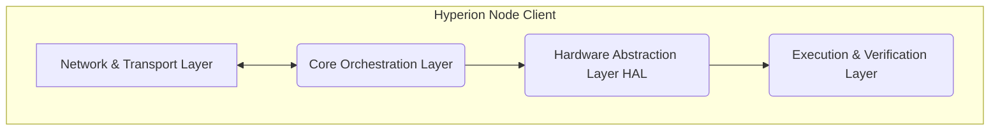

# Hyperion Engine

> **The Sovereign Compute Layer for Decentralized Physical Infrastructure Networks (DePIN).**

[](https://github.com/hyperion-labs/hyperion-engine)
[](https://opensource.org/licenses/Apache-2.0)
[](https://www.rust-lang.org/)

## 🌌 Overview

**Hyperion Engine** is an industrial-grade, high-performance node client designed to power the next generation of decentralized networks. Built with **Rust** for uncompromising memory safety and concurrency, Hyperion serves as the "brain" and "hands" for DePIN hardware, orchestrating compute, storage, and networking resources with cryptographic integrity.

Designed for stability in hostile network environments and optimized for 24/7 autonomous operation, Hyperion is not just a client—it is the bedrock of the decentralized economy.

## 🏗 Architecture

Hyperion employs a sophisticated 4-Layer Modular Architecture, ensuring scalability and isolation of concerns.



- **Layer 1: Network & Communication**: Libp2p-based encrypted mesh networking.
- **Layer 2: Core Orchestration**: Asynchronous task scheduling and state management.
- **Layer 3: Hardware Abstraction (HAL)**: Vendor-agnostic resource detection (GPU/NPU/CPU).
- **Layer 4: Execution & Verification**: 
    - Pluggable runtimes (AI Inference, Rendering, ZK-Proving).
    - **PoPW (Proof of Physical Work)**: Integrated TEE and ZK-SNARK interfaces for verifiable compute.

## 🚀 Key Features

- **🚀 Rust-Native Performance**: Zero-cost abstractions and memory safety without garbage collection pauses.
- **🛡️ Proof of Physical Work (PoPW)**: Cryptographically verifiable proofs ensuring hardware integrity and task completion.
- **🔌 Modular Execution Runtimes**: Swap computation engines (e.g., Candle for AI, Wasmtime for general compute) without rebuilding the core.
- **🌐 Autonomous P2P Discovery**: Robust peer discovery and DHT-based routing.

## 🛠 Getting Started

### Prerequisites

- Rust (latest stable)
- CMake (for building native dependencies)
- NVIDIA Drivers (optional, for GPU HAL features)

### Installation

```bash
git clone https://github.com/your-org/hyperion_engine.git
cd hyperion_engine
cargo build --release
```

### Running the Node

**Standard Mode (Real Network)**
```bash
cargo run --bin hyperion_engine
```

**Demo Mode (Simulation)**
Run with the `--demo` flag to simulate task allocation, computation, and rewards without connecting to a live network. Perfect for presentations.
```bash
cargo run -- --demo
```

## 📜 License

Distributed under the Apache License, Version 2.0. See `LICENSE` for more information.
